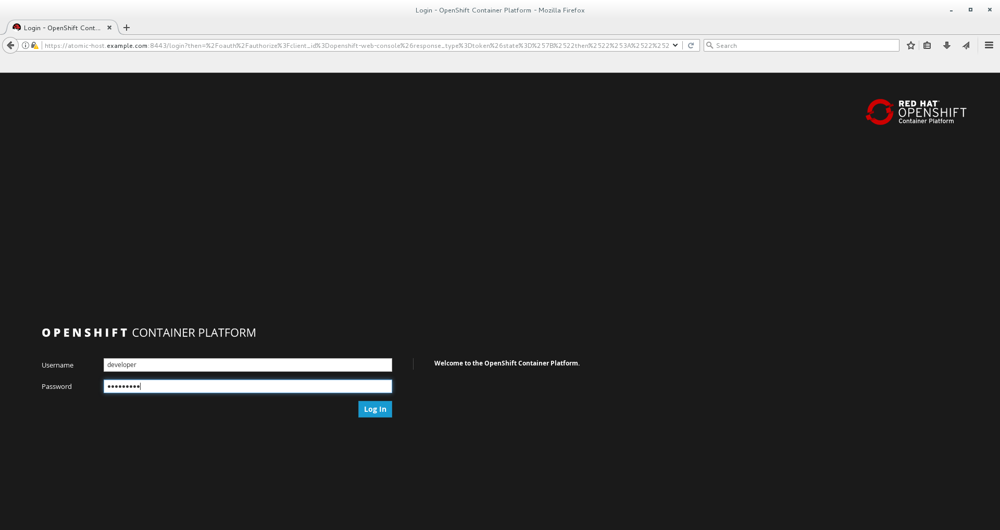
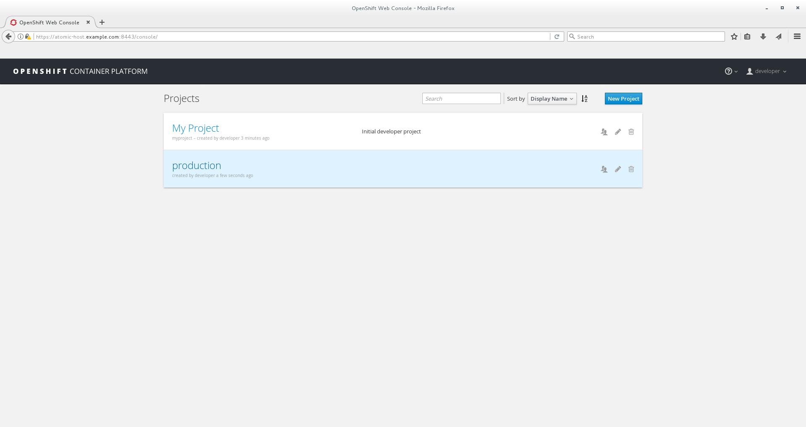
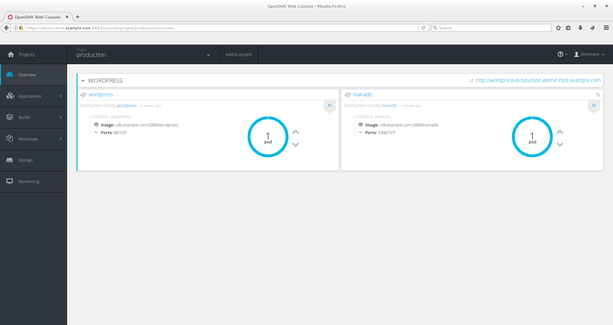
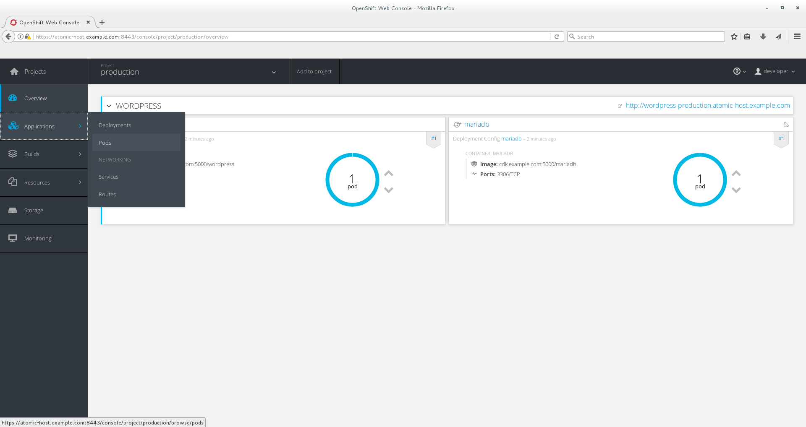
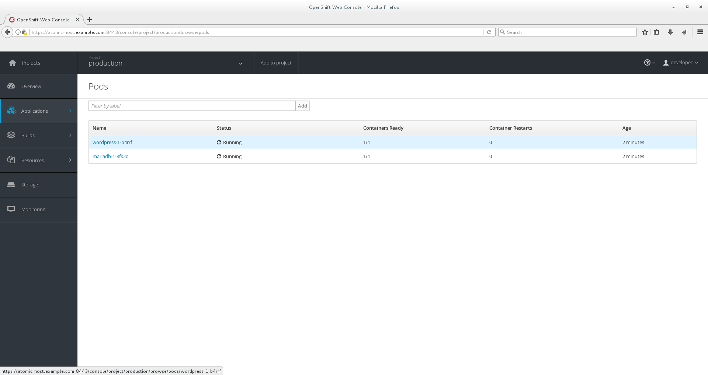
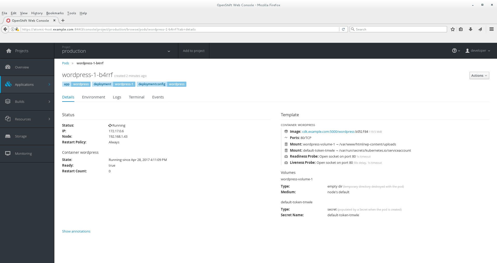

# LAB 5: OpenShift templates and web console

In this lab we introduce how to simplify your container deployments w/ OpenShift templates.  We will also explore the web console.

This lab should be performed on **YOUR ASSIGNED AWS VM** as `ec2-user` unless otherwise instructed.

Expected completion: 20 minutes

## Project preparation

Let's create a new project.
```bash
$ oc new-project production
Now using project "production" on server "https://10.xx.xx.xxx:8443".
```

Ensure you're still logged in as the developer user.
```shell
$ oc whoami
developer
```

## Wordpress templated deployment

This time, let's simplify things by deploying an application template.  We've already included a template w/ lab5 which leverages our wordpress & mariadb images.
```bash
$ cd ~/aws-loft-2017-container-lab/labs/lab5/
$ grep localhost:5000 wordpress-template.yaml
```

Let's deploy this wordpress template:
```bash
# add your template to the production project
$ oc create -f wordpress-template.yaml
template "wordpress" created

# deploy your new template w/ "oc new-app" and note its output
$ oc new-app --template wordpress
--> Deploying template "production/wordpress" to project production
```

View all of the newly created resources
```bash
$ oc get all
```

Wait for rollout to finish
```bash
$ oc rollout status -w dc/mariadb
replication controller "mariadb-1" successfully rolled out

$ oc rollout status -w dc/wordpress
replication controller "wordpress-1" successfully rolled out
```

Verify the database started
```bash
$ oc logs dc/mariadb
mysqld_safe Starting mysqld daemon with databases from /var/lib/mysql
```

Verify wordpress started
```bash
$ oc logs dc/wordpress
/usr/sbin/httpd -D FOREGROUND
```

`oc status` gives a nice view of how these resources connect
```bash
$ oc status
```

Check and make sure you can access the wordpress service through it's route:
```bash
$ oc get routes
$ curl -L wordpress-production.<YOUR AWS VM PUBLIC IP>.nip.io
# OR open the URL in a browser to view the UI
```

OpenShift includes several ready-made templates. Let's take a look at some of them:
```shell
$ oc get templates -n openshift
```

For more information on templates, reference the official OpenShift documentation:

[https://docs.openshift.com/container-platform/latest/dev_guide/templates.html](https://docs.openshift.com/container-platform/latest/dev_guide/templates.html)

[https://docs.openshift.com/container-platform/latest/install_config/imagestreams_templates.html#is-templates-subscriptions](https://docs.openshift.com/container-platform/latest/install_config/imagestreams_templates.html#is-templates-subscriptions)

## Web console

Now that we have deployed our template, let’s login as developer to the OpenShift web console - `https://<YOUR AWS VM PUBLIC DNS NAME HERE>:8443`

The console url can be retrieved with:
```bash
$ oc cluster status
```


And after we’ve logged in, we see a list of projects that the developer user has access to. Let's select the `production` project:


Our project landing page provides us with a high-level overview of our wordpress application's pods, services, and route:


Let's dive a little deeper. We want to view a list of our pods by clicking on `Pods` in the left Applications menu:


Next, let's click on one of our running pods for greater detail:


With this view, we have access to pod information like status, logs, image, volumes, and more:


Feel free to continue exploring the console and thanks for taking the lab!
